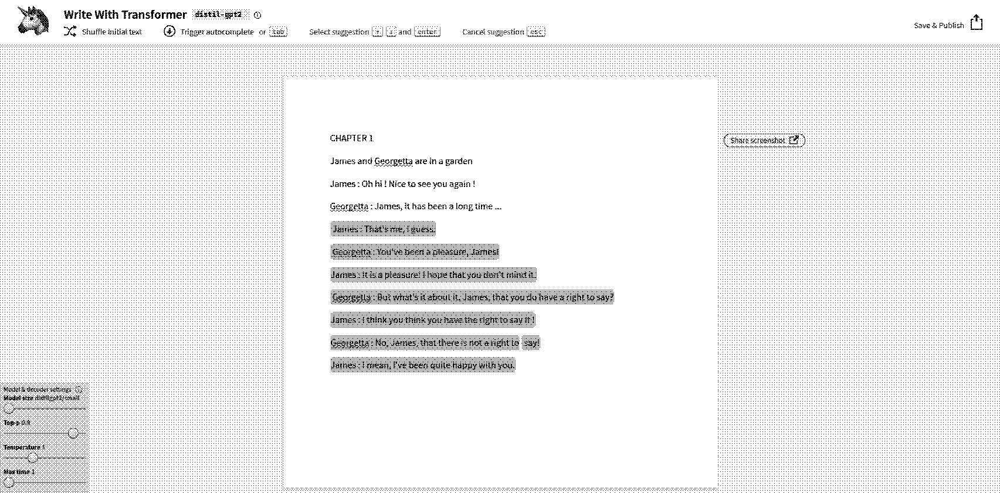
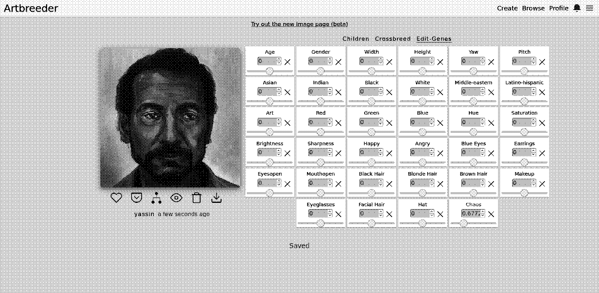
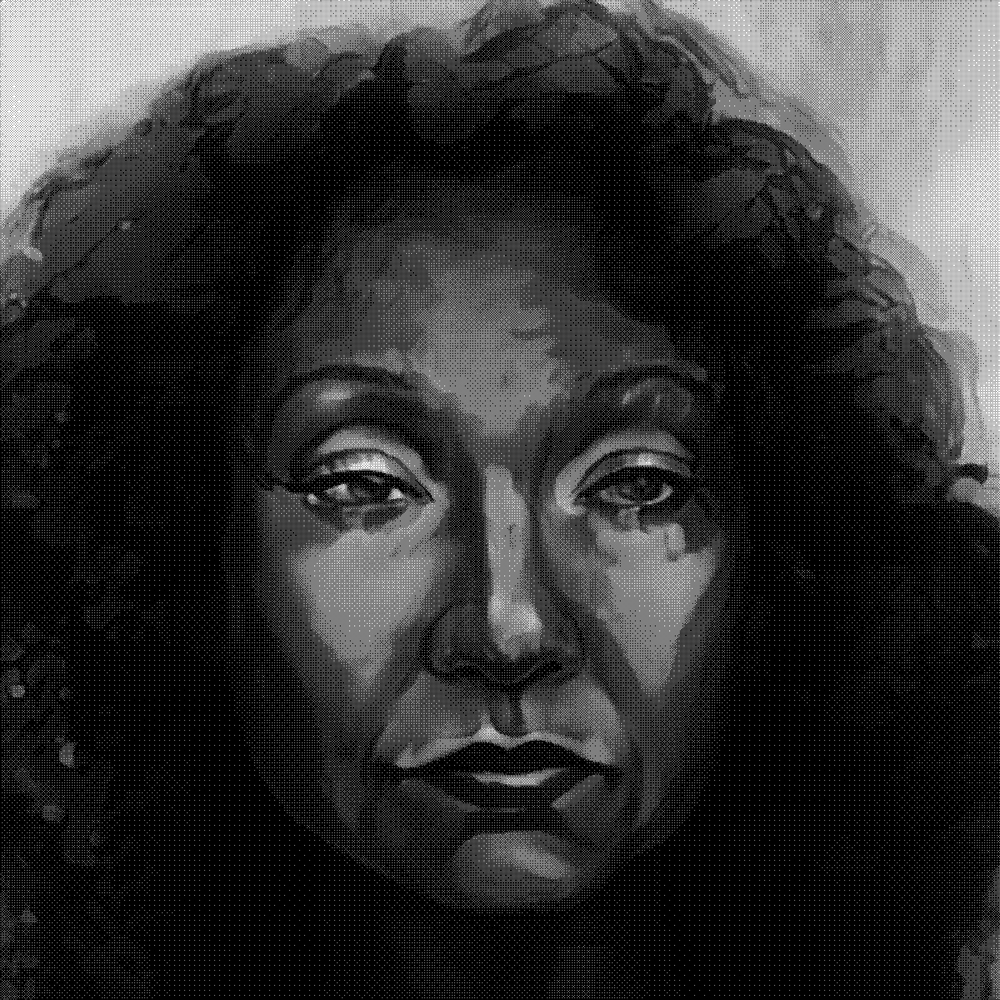
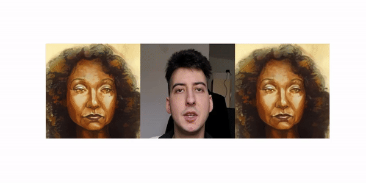

# Write and direct a short movie with machine learning

## Write the scenario

[https://transformer.huggingface.co/](https://transformer.huggingface.co/)

## Create the characters

[https://artbreeder.com](https://artbreeder.com/)

Georgetta

James

## Animate them

[https://github.com/AliaksandrSiarohin/first-order-model](https://github.com/AliaksandrSiarohin/first-order-model)

## Give them a voice

[Google Collab - Mozilla_TTS_WaveRNN.ipynb](https://colab.research.google.com/github/tugstugi/dl-colab-notebooks/blob/master/notebooks/Mozilla_TTS_WaveRNN.ipynb#scrollTo=Hx93hVb6Y8dA)

[click for audio](goorgetta_1.wav)

Georgetta : James, It has been a long time ...

[click for audio](goorgetta_2.wav)

Georgetta : You've been a pleasure, James!

[click for audio](goorgetta_3.wav)

Georgetta : But what's it about it, James, that you do have a right to say?

[click for audio](goorgetta_4.wav)

Georgetta : No, James, that there is not a right to say!

## Add some ambience

[Google Colab - Interact with jukebox](https://colab.research.google.com/github/openai/jukebox/blob/master/jukebox/Interacting_with_Jukebox.ipynb)