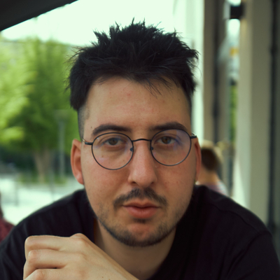

# About me

Hello i'm Yassin a Freelance Full Stack Devops open to remote (or on site Lyon/Paris/Geneva) Work. I'm a creative developer with a passion for machine learning, visual arts, and live coding. I have a strong background in software engineering, with experience in developing web applications, deploying GPU clusters, and training visual models. I have a deep understanding of Kubernetes, Docker, and CI/CD pipelines, and I am proficient in Python and JavaScript.

**Cofounder of :**

**[Creative Code Lyon](https://creative-code-lyon.github.io)**

**Contact :  
yassin[at]siouda.com**

**Social networks**

[Github](http://github.com/Pipazoul)

[Mastodon](https://mastodon.doesnotexist.club/@yassinsiouda)

[Twitter](https://twitter.com/SioudaYassin)  

[LinkedIn](https://www.linkedin.com/in/yassinsiouda/)  
