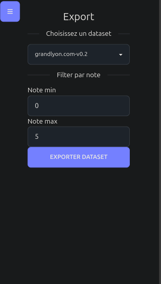

# Alpaca Tinder

Alpaca tinder is an alpaca-based dataset sorting tool for fine-tuning language models made for [Erasme](https://www.erasme.org/)
It allows you to upvote or downvote a conversation and then export the filtered dataset as a json file.

Stack:
- Svelte
- Pocketbase

[Github Repo](https://github.com/urbanlab/alpaca-tinder)