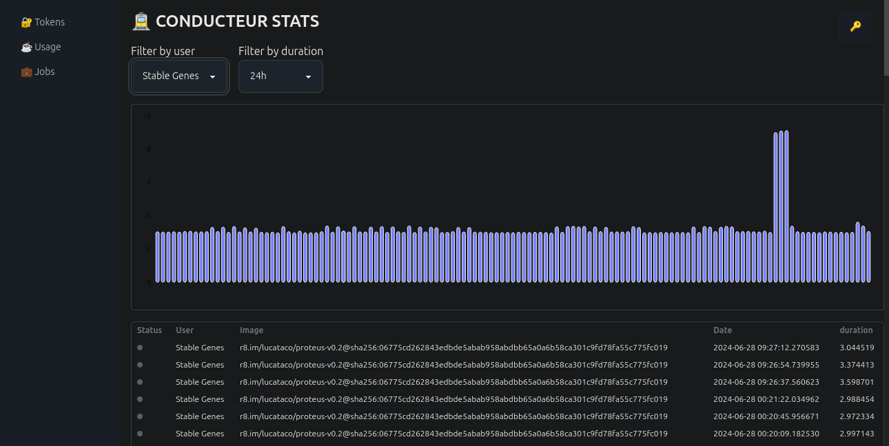
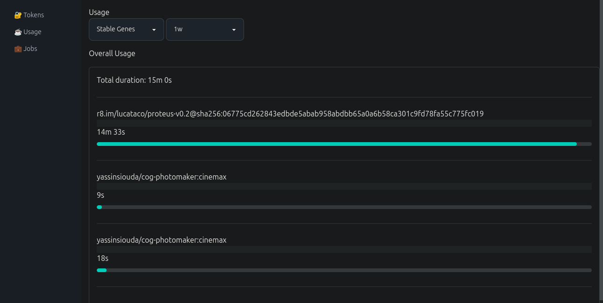

# 🚊 Conducteur

Conducteur is a [cog](https://github.com/replicate/cog) container orchestrator that uses an api to chain together gpu calculations or distribute them to other nodes.
It monitors usage by token and manages access rights by docker image.

Stack:

- Python
  - FastAPI
- Svelte

[Github](https://github.com/Pipazoul/conducteur)