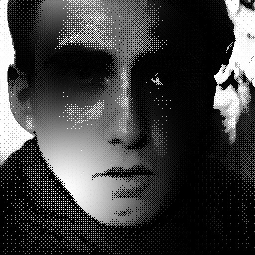
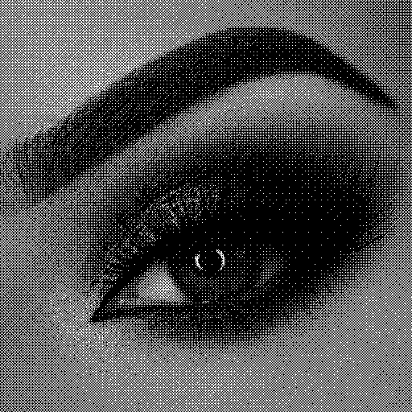

# this.doesnotexist.club

[this.doesnotexist.club](http://this.doesnotexist.club)  is a project to generate images of specific subjects by artificial intelligence 

My experiments led me to realize these two models 

[**THIS FRIEND DOES NOT EXIST**](https://thisfriend.doesnotexist.club/)

On the basis of the photos that I took since my childhood (2008) I extracted all the faces that could be captured, whether family, friends, some strangers, all these faces were used to train a neural network, this one then begins to hallucinate mixtures of all these people who have accompanied me from near or far

[**THIS EYE DOES NOT EXIST**](https://thiseye.doesnotexist.club/)

This model was trained on the basis of the many pinterest boards that can be found around the subject of eyes and makeup, an ideal source of data since they are standardized to be integrated on e-commerce sites