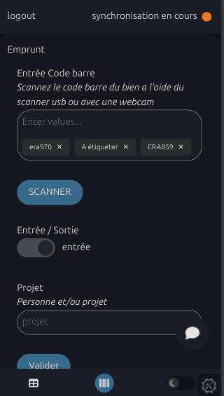

# Gestion Inventaire

Material borrowing tool based on a notion table for [Erasme](https://www.erasme.org/)
Allows material to be brought in or taken out by scanning a bare code or by searching for the reference.

Stack:

- Svelte

[Github](https://github.com/urbanlab/gestion_inventaire)