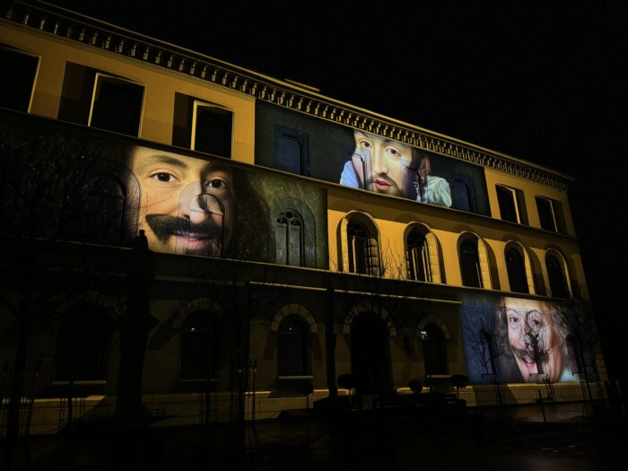

# Grand Mix

Creation of a tech stack (pipeline of machine learning models) to enable [Inook](https://www.inook.com/) to generate face animations for the grand mix project broadcast in Eindhove / Morat.

Credits: Inook

<iframe width="560" height="315" src="https://www.youtube.com/embed/F0p_q0awNcE?si=s1K1R_Im1tHJrMUi" title="YouTube video player" frameborder="0" allow="accelerometer; autoplay; clipboard-write; encrypted-media; gyroscope; picture-in-picture; web-share" referrerpolicy="strict-origin-when-cross-origin" allowfullscreen></iframe>

<iframe width="560" height="315" src="https://www.youtube.com/embed/BeI1wmw1PbU?si=oYMygEDE6JElMb9c" title="YouTube video player" frameborder="0" allow="accelerometer; autoplay; clipboard-write; encrypted-media; gyroscope; picture-in-picture; web-share" referrerpolicy="strict-origin-when-cross-origin" allowfullscreen></iframe>

Stack:

- Windmill
- Replicate
- Cog
- S3 Bucket