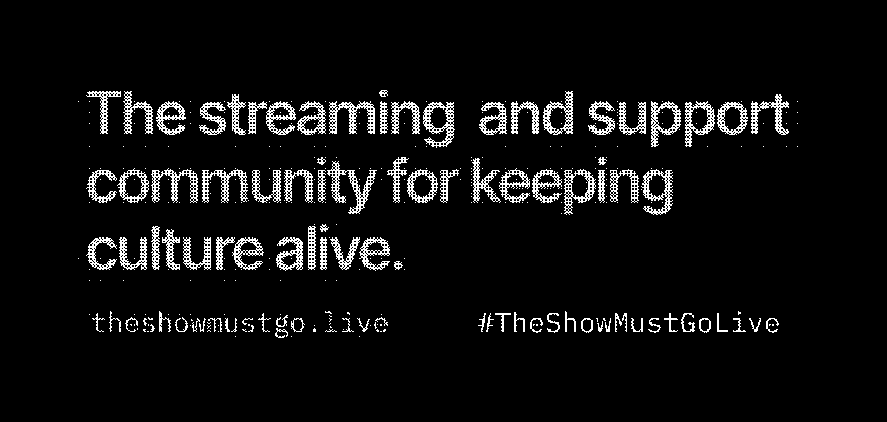

# theshowmustgo.live

Co-founder and Technical Director

theshowmustgo.live is an initiative initially created to :

-   **Support** cultural offers normally requiring physical presence
-   **Contribute** to the financial relief for deprogrammed cultural actors
-   **Provide** another means of consuming culture, with the aid of digital media
-   **Promote** the use of digital culture in an artistic context

The initiative eventually evolved to offer technical expertise as well as volunteer support for the profesionalization of streams for artists and cultural actors